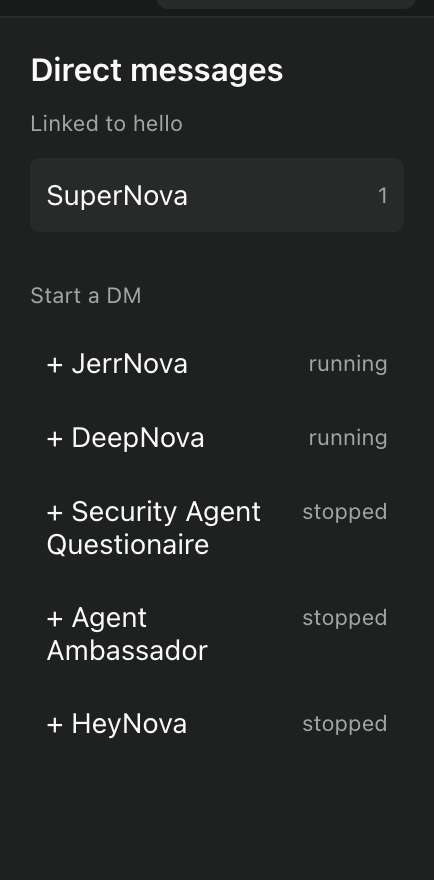
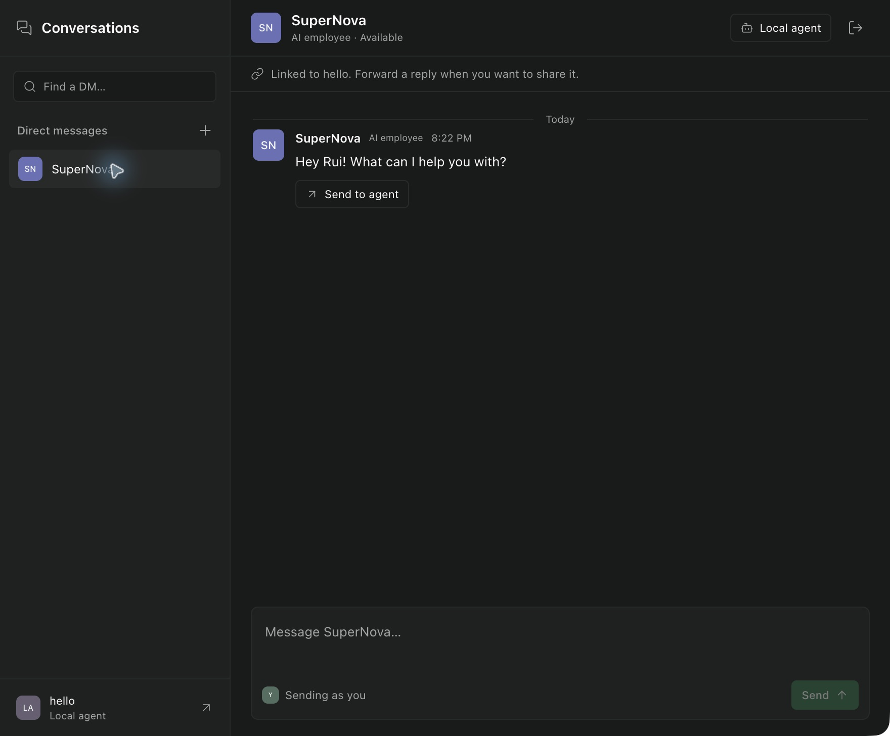

# Employee DMs validation

The macOS desktop build was installed locally and inspected in the real Paseo app.
The screenshots capture that app; the after image is cropped to the Conversations
panel to omit unrelated workspace details.

Observed: the existing SuperNova DM opens with its retained greeting, compact avatar
row, message attribution, linked local agent, and composer. The new-message picker
opens, employee search filters a long name without wrapping, and Escape dismisses it.
The adjacent local agent remains accessible. No live employee question or agent turn
was submitted during UI QA.




| Platform        | Tested | Notes                                                        |
| --------------- | ------ | ------------------------------------------------------------ |
| iOS             | No     | No simulator UI run                                          |
| Android         | No     | No emulator UI run                                           |
| Web             | No     | Shared client typechecked; browser interaction not exercised |
| Desktop macOS   | Yes    | Installed app, existing DM, picker search and dismissal      |
| Desktop Windows | No     | Await CI daemon coverage; no manual UI run                   |
| Desktop Linux   | No     | Await CI daemon coverage; no manual UI run                   |

## Focused automated coverage

36 unique tests passed across the rooms adapter, lifecycle hooks, navigation,
composer draft, session capability persistence, compiler, and both runtime loaders.
Some commands below include intentionally unselected tests. The early grouped rooms
command used the original file location; the later rooms command verifies its final
SDK-compliant `server/` location. Transport tests use an isolated fake bridge and
real local MCP HTTP, not production employees.

The composer regression uses the existing live JSDOM suite; it is not a real browser
E2E. Runtime tests exercise in-process and subprocess loaders, capability rotation,
internal-session exclusion, and teardown. CI owns full-suite verification.

Commands and raw output from local validation:

### host-navigation.test.ts

```sh
npx vitest run plugins/employee-dms/rooms.test.ts packages/server/src/server/plugins/lifecycle/handlers.test.ts packages/app/src/plugins/host-navigation.test.ts --bail=1
```

```text
RUN  v4.1.7 <checkout>

(node:82873) ExperimentalWarning: localStorage is not available because --localstorage-file was not provided.
(Use `node --trace-warnings ...` to show where the warning was created)

 Test Files  4 passed (4)
      Tests  25 passed (25)
   Start at  20:01:11
   Duration  2.92s (transform 4.42s, setup 0ms, import 5.20s, tests 39ms, environment 282ms)
```

### agent-manager.test.ts

```sh
npx vitest run packages/server/src/server/agent/agent-manager.test.ts -t 'session-open MCP capabilities' --bail=1
```

```text
RUN  v4.1.7 <checkout>


 Test Files  1 passed (1)
      Tests  1 passed | 205 skipped (206)
   Start at  20:04:48
   Duration  570ms (transform 324ms, setup 0ms, import 481ms, tests 13ms, environment 0ms)
```

### compiler.test.ts

```sh
npx vitest run packages/server/src/server/plugins/compiler.test.ts -t 'employee conversation entry' --bail=1
```

```text
RUN  v4.1.7 <checkout>


 Test Files  1 passed (1)
      Tests  1 passed | 72 skipped (73)
   Start at  20:29:30
   Duration  462ms (transform 76ms, setup 0ms, import 91ms, tests 279ms, environment 0ms)
```

### input-draft.live.test.tsx

```sh
PATH="<node22-bin>:""$PATH" npx vitest run packages/app/src/composer/draft/input-draft.live.test.tsx --bail=1
```

```text
RUN  v4.1.7 <checkout>


 Test Files  1 passed (1)
      Tests  7 passed (7)
   Start at  20:07:58
   Duration  1.54s (transform 808ms, setup 0ms, import 257ms, tests 973ms, environment 243ms)
```

### runtime.posix.test.ts

```sh
npx vitest run packages/server/src/server/plugins/runtime.posix.test.ts -t 'loads employee DMs' --bail=1
```

```text
RUN  v4.1.7 <checkout>


 Test Files  1 passed (1)
      Tests  2 passed | 41 skipped (43)
   Start at  20:16:28
   Duration  4.66s (transform 2.40s, setup 0ms, import 2.95s, tests 1.59s, environment 0ms)
```

### server/rooms.test.ts

```sh
npx vitest run plugins/employee-dms/server/rooms.test.ts --bail=1
```

```text
RUN  v4.1.7 <checkout>


 Test Files  1 passed (1)
      Tests  4 passed (4)
   Start at  20:12:45
   Duration  167ms (transform 43ms, setup 0ms, import 79ms, tests 18ms, environment 0ms)
```

## Typecheck

```text
> paseo@0.11.1 typecheck
> npm run typecheck --workspaces --if-present


> @getpaseo/builtin-plugins@0.11.1 typecheck
> tsgo -p tsconfig.json --noEmit


> @getpaseo/expo-two-way-audio@0.11.1 typecheck
> tsgo --noEmit


> @getpaseo/highlight@0.11.1 typecheck
> tsgo --noEmit


> @getpaseo/plugin@0.11.1 typecheck
> tsgo --noEmit && tsgo -p tsconfig.examples.json --noEmit


> @getpaseo/protocol@0.11.1 pretypecheck
> npm run generate:validators


> @getpaseo/protocol@0.11.1 generate:validators
> node scripts/generate-validation-aot.mjs

generated src/generated/validation/ws-outbound.aot.ts from codegen/ws-outbound.compile.ts (WSOutboundMessageSchema)

> @getpaseo/protocol@0.11.1 typecheck
> tsgo --noEmit


> @getpaseo/client@0.11.1 typecheck
> tsgo --noEmit


> @getpaseo/server@0.11.1 typecheck
> tsgo -p tsconfig.server.typecheck.json --noEmit


> @getpaseo/app@0.11.1 typecheck
> tsgo --noEmit


> @getpaseo/relay@0.11.1 typecheck
> tsgo --noEmit


> @getpaseo/website@0.11.1 typecheck
> tsgo --noEmit


> @getpaseo/desktop@0.11.1 typecheck
> tsgo --noEmit -p tsconfig.json


> @getpaseo/cli@0.11.1 typecheck
> tsgo --noEmit
```

## Lint

```text
> paseo@0.11.1 lint
> oxlint

Found 0 warnings and 0 errors.
Finished in 606ms on 4599 files with 177 rules using 18 threads.
```

## Formatting

```text
> paseo@0.11.1 format:check
> oxfmt --check .

Checking formatting...

All matched files use the correct format.
Finished in 680ms on 4936 files using 18 threads.
```
